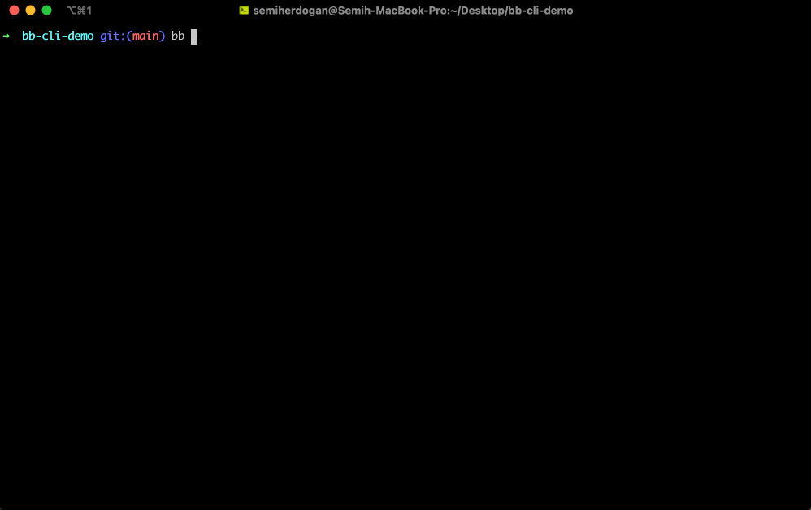

# Bitbucket Rest API CLI

Use Bitbucket from command line. With this app you can see pull request, pipelines, branchs etc. from your terminal.

## Installation

__NOTE__: Before install this package, you should have PHP installed on your machine.

* Download standalone binary from [releases](https://github.com/bb-cli/bb-cli/releases)
* Move downloaded file to path like `mv bb.phar /usr/local/bin/bb`
* Let's start `bb help`

## Usage

[View the documentation](https://bb-cli.github.io) for usage information.

## License

The MIT License (MIT). Please see [License File](LICENSE) for more information.
