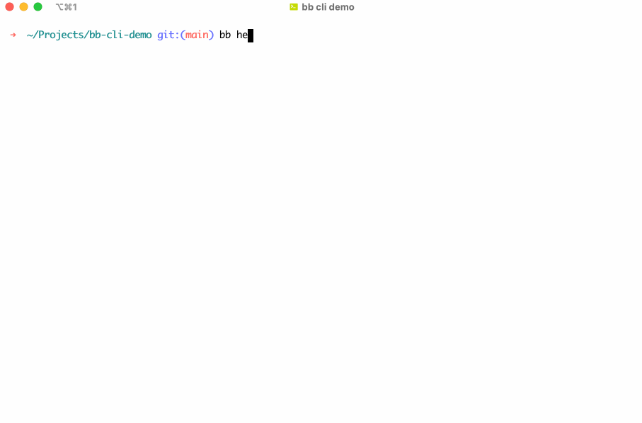

# Bitbucket Rest API CLI

Use Bitbucket from command line. With this app you can see pull request, pipelines, branches etc. from your terminal.



## Installation

__NOTE__: Before install this package, you should have **PHP >= 7** installed on your machine. For an alternative, use Docker instructions below.

* Download standalone binary from [releases](https://github.com/bb-cli/bb-cli/releases)
* Move downloaded file to path like `mv bb /usr/local/bin/bb` or `mv bb ~/.local/bin/bb`
* For testing `bb help`
* Let's move on to the [auth.](https://bb-cli.github.io/authentication)

## Docker Setup
As an alternative to having a PHP runtime installed locally, you can make use of a Docker container to run Bitbucket CLI.
First, make sure to create `~/.bitbucket-rest-cli-config.json` beforehand:
```shell
touch ~/.bitbucket-rest-cli-config.json
```

Then, run the tool:
```shell
docker run -it --rm --mount type=bind,source="$HOME/.bitbucket-rest-cli-config.json",target=/root/.bitbucket-rest-cli-config.json --mount type=bind,source="$(pwd)",target=/workdir,readonly ghcr.io/bb-cli/bb-cli help
```

For ease, configure this as an alias in your chosen shell:
```shell
alias bb='docker run -it --rm --mount type=bind,source="$HOME/.bitbucket-rest-cli-config.json",target=/root/.bitbucket-rest-cli-config.json --mount type=bind,source="$(pwd)",target=/workdir,readonly ghcr.io/bb-cli/bb-cli'
```

Then use `bb help` and `bb auth` as expected in the documentation.

## Usage

[View the documentation](https://bb-cli.github.io) for usage information.

## Development

This tool developed with help of [Github Copilot](https://copilot.github.com) :octocat:

## License

The MIT License (MIT). Please see [License File](LICENSE) for more information.
